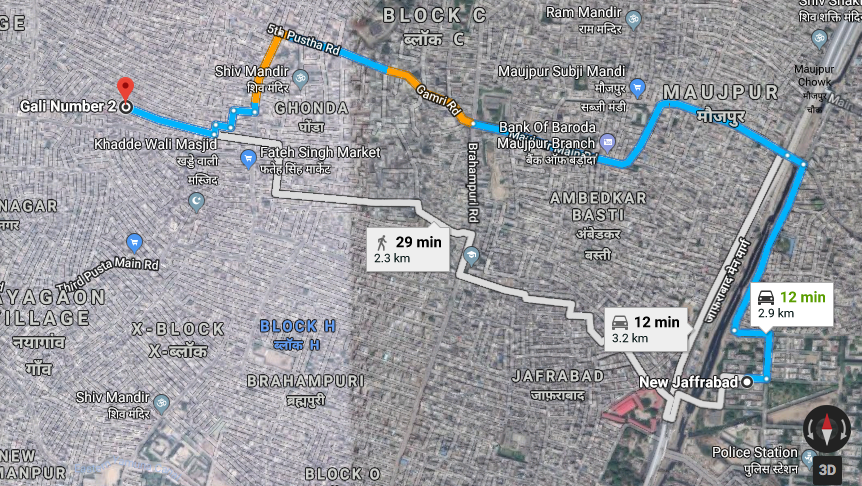

# Preparing Datasets

Datasets:

|     Dataset        |        Aggregated travel times between every zone pair in the city                                                     |
|-------------|-------------------------------------------------------------|
| Time Period | Q1 2018                                                     |
| City        | Delhi                                                       |

```{r}
suppressPackageStartupMessages(library(tidyverse))
new_delhi_wards <- read.csv("Data/uber_delhi_ward_ids.csv", stringsAsFactors = FALSE)
inter_ward_times <- data.table::fread("Data/new_delhi-wards-2018-1-All-HourlyAggregate.csv", stringsAsFactors = F)
```

Inter ward distance was calculated through QGIS using the the wards geojson file downloaded from the UBER Movement website for DELHI. Process was:

- To first find the center of each polygon
- To calculate a distance matrix from each polygon center to other for all ploygons

```{r}
inter_ward_distance <- data.table::fread("Data/spatial/distance_matrix.csv", stringsAsFactors = F, data.table = FALSE)
```

Merging Distance and Time components

```{r}
inter_ward_matrix <-
  dplyr::left_join(
    inter_ward_times,
    inter_ward_distance,
    by = c('sourceid' = 'InputID', 'dstid' = 'TargetID')
  )
```

Converting distance to kilometer
```{r}
inter_ward_matrix$distance_km <- inter_ward_matrix$distance_metre/1000
```

# Time per km ranges at every Hour of the day

The objective of this analysis is to focus on the congestion of vehicular activity on
city routes. Since the current dataset from UBER gives us just the travel times, it is importatnt to normlaise it by the distance metric, thus focusing on time taken on covering every km of a route (assumption being that every km takes the equal amount of time, certainly not the case, but this should be good for an EDA) and treating it as a proxy of business of that route. 

```{r}
inter_ward_matrix$time_per_km <- inter_ward_matrix$mean_travel_time/inter_ward_matrix$distance_km
```

Let's now look at the density plots for time per km at every hour of the day - This will help us see the range of times and check if the flow rate of city traffic is constant at every hour or varies across routes

Excluding the rides done in the same Movement zone, as the distance is not calculated for such cases. 
```{r facet_hod, echo=FALSE}
library(ggplot2)

ggplot(inter_ward_matrix[!is.na(inter_ward_matrix$distance_degree),], aes(x = time_per_km)) +
  geom_density(alpha=.2, fill="#FF6666") +
  facet_wrap(~ hod, nrow=6) + xlab("Time per km (seconds)")
```

Results:

- There are high peaks from 0-6 hours as the congestion seems to be less at these points, so most rides are able to maintain a good flow rate, 75% of these rides cover a distance of a km in less than *150* seconds
- The peaks turns a bit flat after 7 AM and the width increases, as the congestion increases, so is the variability with time.

Let's look at the 90th percentile of *time taken per km* at every hour
```{r quantile_distribution, include=FALSE}
quantile_vec <- c()
for(i in 1:24){
 quantile_vec <- c(quantile_vec,quantile(inter_ward_matrix$time_per_km[inter_ward_matrix$hod==(i-1) & !is.na(inter_ward_matrix$distance_degree)], 0.9))
}
quantile_df <- data.frame('hod' = 0:23, quantile_vec)
```

```{r quantile_distribution_plot, echo=FALSE}
quantile_plot <- ggplot(data = quantile_df, aes(x = hod,y = quantile_vec)) + geom_bar(stat = 'identity') +
  ylab("Time per km (95th percentile)") + xlab('Hour of the day')
quantile_plot
```

Observations:

Being rush office hours, 

- First peak is around 11-13, where TPK (Time per km) is close to 300s
- Second peak is around 17-20 where the TPK goes almost till 350s

Till now we were only working with hod(Hour of the day), now lets take the route into consideration as well

Busiest routes throughout the day (Top 10): 

```{r}
x <- inter_ward_matrix %>% filter(!is.na(time_per_km))%>% group_by(sourceid, dstid) %>%
  summarise(mean_tpk = mean(time_per_km))
x <- dplyr::left_join(x, inter_ward_distance, by = c('sourceid' = 'InputID', 'dstid' = 'TargetID'))
x <- x[order(-x$mean_tpk), ]
x[1:10,c(1,2,3,5)]
```

> Shorter routes will tend to have a greater TPK, as for larger routes this metric gets time to decrease because of more occurrences of light congestion segments as compared to shorter routes. 

Let's look at the same table again but now between routes which are atleast greater than a km. 
```{r}
x <- x[x$distance_metre >= 1000, ]
x <- x[order(-x$mean_tpk), ]
x[1:10,c(1,2,3,5)]
```

Observations: 

These are actually pretty congested areas - 

- Though shorted distances, the average time is ~15 mins
- The time taken between these wards was verified on Google Maps and the results were pretty close
- These areas lies in region with high population and high commercial activities, not so good roads and a heavy traffic at pretty much any time of the day

The satellite view - one of the busiest route (181 - 178) looks like this



The UBER Movement web UI is amazing, its good from a single user perspective, but if a city planner wants to have compare mutiple routes at once, then it can be a bit difficult. You are always tied to a source and a destination for certain analyses, and though the avergae time for every ward from a source can be identified by a map view, the same thing cannot be done for a destination. 

Let's fix our destination at the Delhi Airport Ward (There is no dedicated ward for this, so taking the closest one - Ward No 5 as a proxy) and look at average times (TPK) from every other ward
```{r}
dst5 <- inter_ward_matrix[inter_ward_matrix$dstid==5,]
dst5 %>% group_by(sourceid) %>% summarise(mean_tpt = mean(time_per_km)) %>% top_n(5, mean_tpt) %>%   data.frame()
```

The results are same as above, short routes having a higher TPK, but the last two sources are interesting. 

- Both of them are over 10 Km's. 
- Source 288 lies in between Source 255 and Airport
- The route starts from the eastern parts of Delhi and ends at the Southern part (People coming to airport from these routes shoule definitely be wary of this fact)

# Longest Journeys (in terms of time taken to complete) in a city

```{r}
library(knitr)
inter_ward_matrix[is.na(inter_ward_matrix)] <- ''
inter_ward_matrix %>% top_n(10, mean_travel_time) %>% select(sourceid, dstid, hod, mean_travel_time,distance_km,time_per_km)  %>% arrange(desc(mean_travel_time)) %>% kable()
```


These are the routes with the higest travel times in Delhi. Some observations:

- As observed in the earlier analysis as well, _21_ and _18_ are the hours which contribute to the highest times, congestion is at its peak during these times. 
- We can eliminate distance as a factor specifically in routes (Top 4 in this case) which are in the same ward. Ward 5, 3 and 223 are all _closest to the airport_ and therefore have the highest journey times at these hours, definitely something for the traffic authorities to look at
- Route No 2 (193) is all contained within Shahdara, which is indeed considered to be one of the most congested areas in Delhi, ride times within the region can go upto _1 and a half_ hours
- _Ward 32_ (METRO MALL, Pocket 1, Sector 14 Dwarka, Dwarka, New Delhi) - There are 3 routes in the top 10 with this as the destination. But one thing in common among these routes is the ride distance which is more than 30 KM's but still there TPK is close to _4.5_ minutes (15 Km/hour), which is on the slower side

# Time deviations on the same route

We know that there are peak times in a day when the travel time increases and usually it increases by around 15-20 mins and thats what the data says as well. 
```{r}
summary(route_deviations_df$route_deviation)
```

The _mean time deviation_ for more than 80% rides is close to _13 mins_ (820 s)

But the max deviation for a route is more than _5000 s_ (almost an hour and 20 mins). This is where we want to focus our analysis on, so let;s find out those 0.5 percentile of routes (if any), where the deviation is more than _30 mins_ (1800 s)

```{r calculating route deviations, eval=FALSE, include=FALSE}
sdgroup <- function(movement_id){
time_start <- Sys.time()
sdl <- list()
sdl$route_start <- list()
sdl$route_end <- list()
sdl$route_sd <- list()
pb <- txtProgressBar(min = 1,max = 290,char = "-",style = 2)
for(i in 1:290){
setTxtProgressBar(pb, i)
sdv <- sd(inter_ward_matrix$mean_travel_time[inter_ward_matrix$sourceid == movement_id & inter_ward_matrix$dstid == i])
    sdl$route_start[[i]] <- movement_id
    sdl$route_end[[i]] <- i
    sdl$route_sd[[i]] <- sdv
}
close(pb)
time_taken <- stringr::str_replace_all(as.character(Sys.time() - time_start),pattern = "Time difference of ",replacement = "")
print(glue::glue(" -- completed {movement_id} in {time_taken} -- "))
return(sdl)
}

all_routes <- seq(1,290)
# route_deviations <- parallel::mclapply(all_routes, sdgroup,mc.preschedule = TRUE, mc.cores = 4)
# readRDS(Data/route_devialtions.rds)
# route_deviations_df <- data.frame(matrix(nrow = 0,ncol = 3))
# names(route_deviations_df) <- c('route_start', 'route_end', 'route_deviation')
# for(i in 1:290){
#   rdf <- data.frame(route_start=unlist(route_deviations[[i]]$route_start), 
#                                     route_end = unlist(route_deviations[[i]]$route_end),
#                                     route_deviation = unlist(route_deviations[[i]]$route_sd))
#   route_deviations_df <- dplyr::bind_rows(rdf, route_deviations_df)
# }
# saveRDS(route_deviations_df, "Data/route_devialtions.rds")
```


```{r}
route_deviations_df <- readRDS("Data/route_devialtions.rds")
route_deviations_df <- route_deviations_df[!is.na(route_deviations_df$route_deviation), ]
route_deviations_df %>% filter(route_deviation > 1800) %>% arrange(desc(route_deviation)) %>% head(10)
```

So, there are a total of _111_ such routes. Let's see if we could find some patterns here: 

- Looking at the dataset for the route with most deviation(133), we found that there are only _2_ rows in the base dataset, which means that the data is available for only a coupe of hours. This won't be a fair comparison with other routes where the data is avialable for all 24 hours. So ;et's remove them from this dataset and look at these observartions again

```{r}
number_instances <-
  inter_ward_matrix %>% group_by(sourceid, dstid) %>% summarise(total_hod = length(hod))
  
  route_deviations_df <-
  dplyr::left_join(
  route_deviations_df,
  number_instances,
  by = c('route_start' = 'sourceid', 'route_end' = 'dstid')
  )
  
  route_deviations_df %>% filter(route_deviation > 1800 &
  total_hod > 6) %>% arrange(desc(route_deviation))
```

We now have 4 routes with atleast 6 observations. Some observations:

- These routes are affected the most due to congestion as the same ride will take almost the double amount of time to complete in peak hours
- All of them have a deviation of close to __30 mins__ 

```{r}
ggplot(data = inter_ward_matrix[inter_ward_matrix$sourceid== 119 & inter_ward_matrix$dstid == 140,], aes(hod,mean_travel_time)) +  geom_point(shape = 16, size = 5) + xlab('Hour of the day') + ylab('Mean travel time (in seconds)') + theme_minimal()
```

- These are longer routes (~25-30 Km's)
- If you'll observe the scatter plot, these routes suffer the most between 3 PM till 9 PM
- These routes can be termed as end to end routes, as they start and end mostly at the points which lie on the perimeter of Delhi. Most of these routes start from the Eastern part and end at the Western parts, moving through Central Delhi. 
